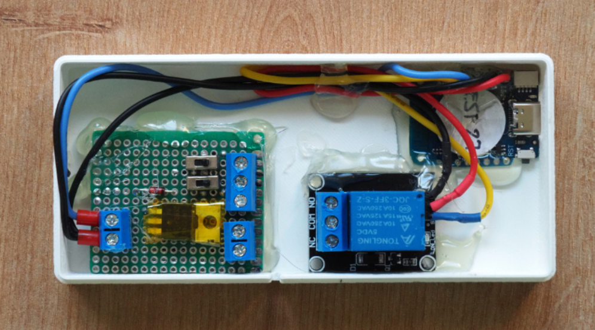
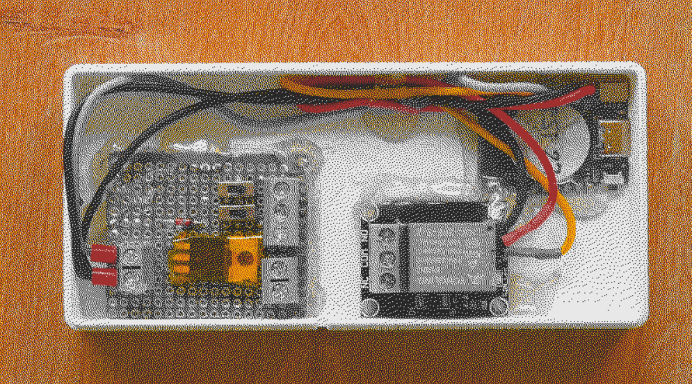
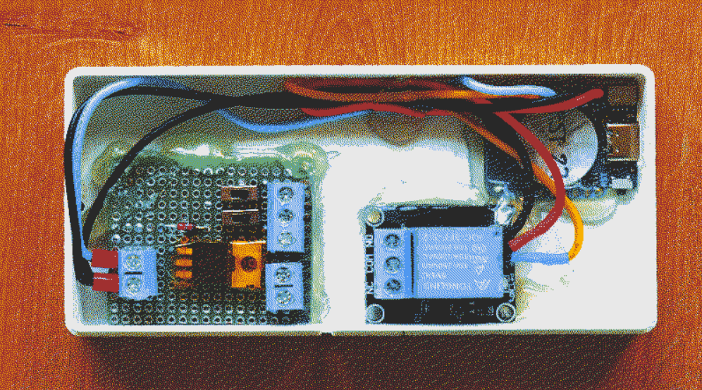

Inspired by [this @chiptron great idea](https://x.com/chiptronCZ/status/1920553957169995872) 

## Original

https://zivyobraz.chiptron.cz/ 

Author: @chiptronCZ on x.com

#### Modifications:

- Added gamma correction
- Added EPD colors simulation
- Added dithering with Floyd-Steinberg algorithm
- Added an option to view EPD color adjustments only (to compare with the original image)
- Download of the posterized/dithered image

#### Examples:

Original image:

RGBY display with Floyd-Steinberg dithering:

6-color display with Floyd-Steinberg dithering:
